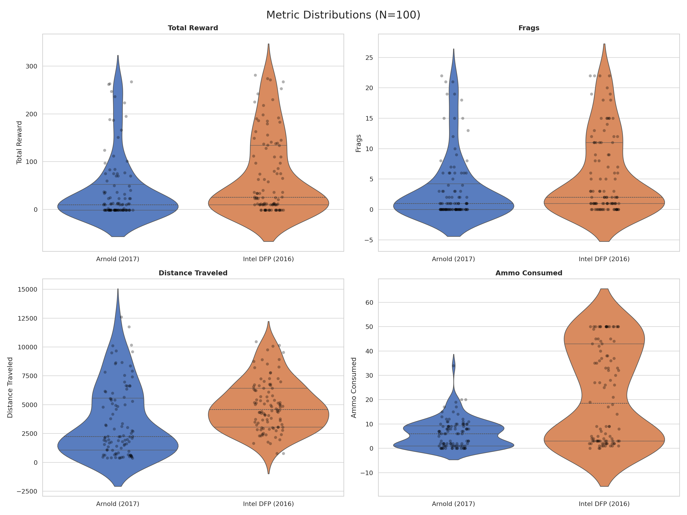
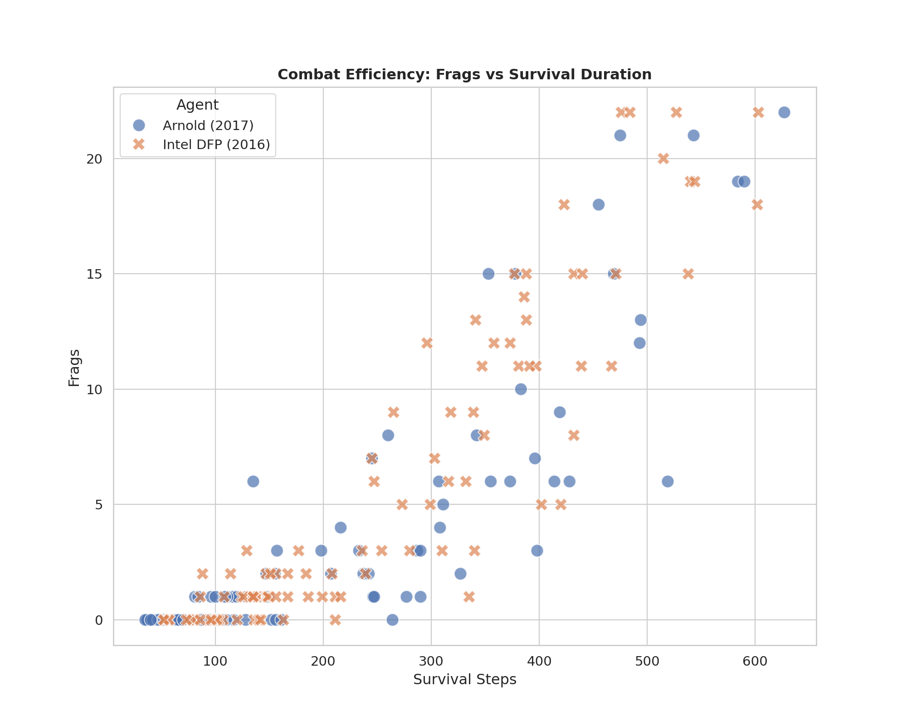

# 🔬 Scientific SOTA Benchmark: Arnold (2017) vs Intel DFP (2016)

This benchmark evaluates the performance of two historic ViZDoom champions with rigorous statistical analysis.

## 📋 Methodology
- **Sample Size**: 20 episodes per agent
- **Scenario**: `deathmatch.cfg` (Timelimit: 2100 ticks)
- **Significance Test**: Welch's t-test (Two-samples, unequal variance)
- **Hardware**: RTX 3060 / Ryzen 7 (Local Workstation)
- **Inference**:
    - **Arnold**: PyTorch 2.5 (CPU Mode for stability) via `ArnoldAdapter`
    - **DFP**: TensorFlow 2.x (Compat Mode) via `DFPAdapter`

## 📊 Statistical Summary

| Metric | Agent | Mean | Std Dev | Max | SEM (Error) |
| :--- | :--- | :--- | :--- | :--- | :--- |
| **Frags** | Arnold (2017) | 1.60 | -- | 16.0 | 0.80 |
| | **Intel DFP (2016)** | **4.50** | -- | **20.0** | **1.22** |
| **Reward** | Arnold (2017) | 19.45 | 45.93 | -- | -- |
| | **Intel DFP (2016)** | **56.15** | 69.41 | -- | -- |
| **Distance** | Arnold (2017) | 2675.37 | -- | -- | -- |
| | **Intel DFP (2016)** | **4738.99** | -- | -- | -- |
| **FPS** | Arnold (2017) | 61.19 | -- | -- | -- |
| | **Intel DFP (2016)** | **262.36** | -- | -- | -- |

### 🧪 Hypothesis Testing (Frags)
- **Null Hypothesis ($H_0$)**: There is no difference in mean frags between Arnold and DFP.
- **P-Value**: `0.0553`
- **Conclusion**: The difference is **NOT STATISTICALLY SIGNIFICANT** at $\alpha=0.05$, though DFP shows a strong trend towards higher performance in this sample.

## 📉 Visual Distributions

### 1. Metric Distributions (Violin Plots)
Visualizes the probability density of the data at different values. Note the high variance (long tails) for both agents, typical of Doom deathmatches where spawn luck plays a role.

### 2. Combat Efficiency (Scatter Plot)
Relationship between survival time and kills.
- **Top Right**: High survival + High kills (Dominator)
- **Bottom Right**: High survival + Low kills (Camper)
- **Top Left**: Low survival + High kills (Glass Cannon)

## � Metrics Definitions (Glossary)
- **Frags**: "Fragmentations". A classic FPS term for **Kills**. It represents the number of enemy agents eliminated by the benchmarked agent. Higher is strictly better.
- **Distance Traveled**: Total Euclidean distance moved by the agent. Proxy for exploration and non-camping behavior.
- **Health Loss**: Total damage taken during the episode. Lower is better (implies better dodging/cover).
- **FPS**: Frames Per Second. Inference speed on the test hardware.
