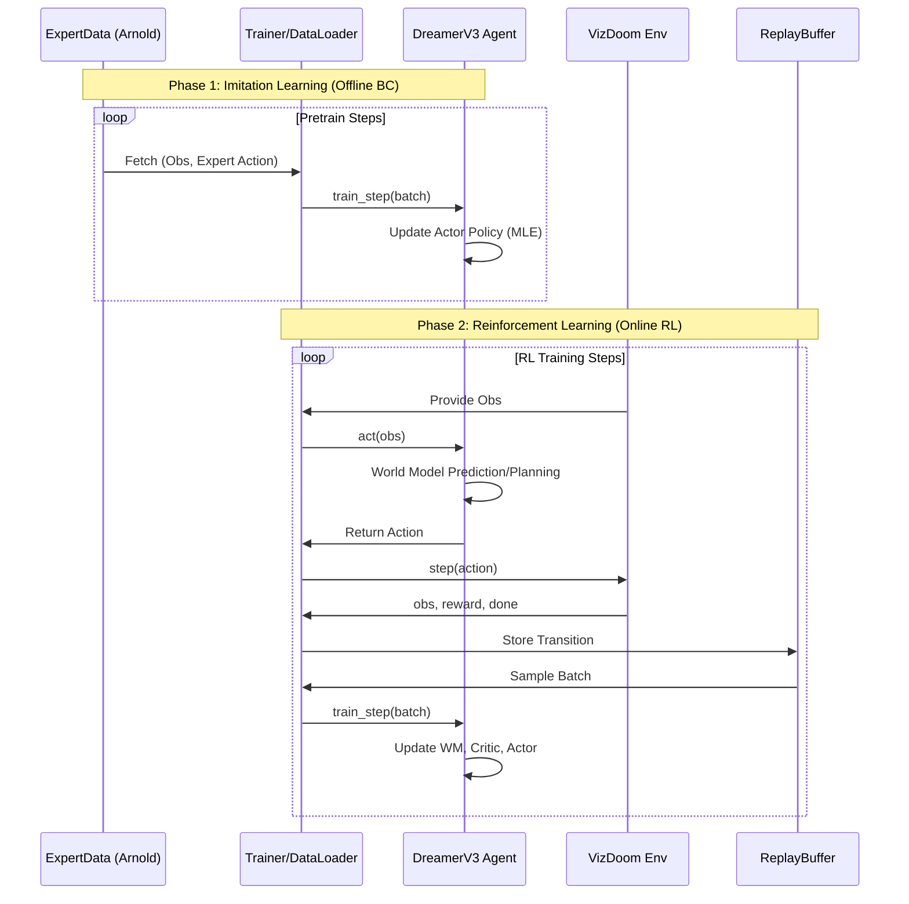

# 🧠 Scientific Foundation: World Models & Imitation Learning in VizDoom

This document explains the theoretical underpinnings of the agents used in this research, specifically focusing on the transition from specialized architectures to general-purpose World Models.

## 1. Dreamer V3: Mastering Diverse Domains

[Hafner et al., 2023]

DreamerV3 builds upon the Model-Based Reinforcement Learning (MBRL) paradigm. Unlike Model-Free agents (PPO, DQN) that learn a direct mapping from observations to actions, Dreamer learns a **World Model** to simulate the environment.

### Recurrent State-Space Model (RSSM)

The agent maintains a latent state $(h_t, z_t)$ where:

- **$h_t$ (Deterministic)**: A GRU-based history representation.
- **$z_t$ (Stochastic)**: Categorical variables (32x32) that represent discrete concepts. Discretization prevents the world model from collapsing and improves robustness to pixel-level noise.

### Components

1. **Encoder/Decoder**: Maps pixels to latents and back. Uses **SymLog** scaling to handle rewards and observations of varying magnitudes.
2. **Dynamics (Prior)**: Learns to predict $p(z_{t+1}|h_t, a_t)$ without seeing the next frame.
3. **Representations (Posterior)**: Learns $q(z_t|h_t, x_t)$ by seeing the actual observation.
4. **Behavior Learning**: The agent trains in **Imagination** for ~15 steps into the future, using its internal world model to optimize an Actor-Critic pair.

---

## 2. Historical SOTA Baselines

### Arnold (2017)

[Lample & Chaplot, "Playing FPS Games with Deep Reinforcement Learning"]

- **Architecture**: DRQN (Deep Recurrent Q-Network).
- **Key Innovation**: Augmented the agent with secondary game features (e.g., enemy detection, item presence) and used separate networks for navigation and combat.

### Direct Future Prediction (DFP, 2016)

[Dosovitskiy & Koltun, "Learning to Act by Predicting the Future"]

- **Architecture**: Specialized Multi-Objective branch.
- **Key Innovation**: Bypassed standard Reinforcement Learning (Bellman equations) in favor of supervised-style prediction of "future measurements" (Health, Ammo, Frags).

---

## 3. Imitation Learning: Behavior Cloning (BC)

Directly applying RL in sparse reward environments like VizDoom Deathmatch often leads to slow convergence (the "Cold Start" problem).

### Mathematical Formulation

$L_{BC}(\theta) = \mathbb{E}_{(s,a) \sim \mathcal{D}_{expert}} [-\log \pi_{\theta}(a|s)]$

El **Behavioral Cloning (BC)** es la forma más simple de Imitation Learning, donde se trata el aprendizaje como un problema de aprendizaje supervisado. Esta técnica tiene sus raíces en pioneros como **ALVINN** (Pomerleau, 1989).

Sin embargo, el BC puro sufre de **compounding errors**. Soluciones modernas como **DAgger** (Ross et al., 2011) o el uso de IL como bootstrap para RL (como en **AlphaStar**, Vinyals et al. 2019), permiten mitigar estos fallos en entornos estratégicos.

### Flujo de Entrenamiento: Pre-training + RL

---

## 4. Academic References

- **DreamerV3**: Hafner et al. (2023). Mastering Diverse Domains through World Models. *arXiv:2301.04104*.
- **Arnold**: Lample & Chaplot (2017). Playing FPS games with deep RL. *AAAI*.
- **DFP**: Dosovitskiy & Koltun (2016). Learning to act by predicting the future. *arXiv:1611.01779*.
- **AlphaStar**: Vinyals et al. (2019). Grandmaster level in StarCraft II. *Nature*.
- **ALVINN**: Pomerleau (1988). Autonomous land vehicle in a neural network. *NIPS*.
- **DAgger**: Ross et al. (2011). No-regret online learning for IL. *AISTATS*.
- **ViZDoom**: Wydmuch et al. (2018). ViZDoom: A Doom-based AI research platform. *IEEE ToG*.
